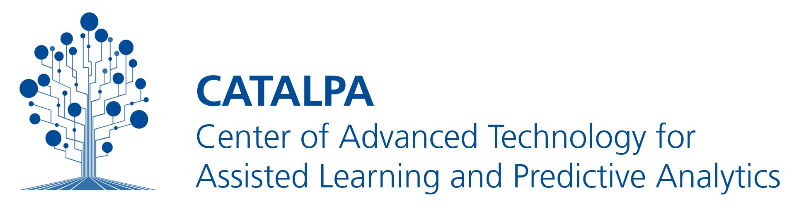

# WESPA - Web Service for Etherpad Analysis

WESPA is a Python-based tool and web service tailored for analysis of Etherpad collaboration data. It supports full extraction of changesets, text reconstruction, and multi-dimensional analysis of co-editing behavior and linguistic patterns.

<br><br>

<p align="center" hidden>
  
</p>

<p align="center">
  <a href="#key-features">Key Features</a> •
  <a href="#how-to-use">How To Use</a> •
  <a href="#download">Download</a> •
  <a href="#credits">Credits</a> •
  <a href="#related">Related</a> •
  <a href="#citation">Citation</a> •
  <a href="#license">License</a>
</p>

## Key Features

**Analysis**

- extracts etherpad changesets
- reconstructs text from etherpad changesets
- computes measures about what pad authors edited text writen by another author
- constructs a network graph of bidirection co-editing activities
- linguistic analysis of texts
- processes data of multiple etherpads from multiple groups of authors

**Analytics Engine**

- Can be run as a webservice

## Roadmap

**Next steps**

- create versions of the collaboratively created text documents
- handle peer review data
- setup poetry instead of pip
- add code comments to all classes and functions
- finish scheduler and API in app.py
- load data from postgres in addition to csv
- store results in a resultsstore db, also on postgres
  - store data per user and group, considering course, course-task/pad, and time frames like weeks/days
    - use existing descriptive features here
- handle other moodle activities?

## How To Use

**Prerequisits**

- Python 3.11.6
- poetry

```bash
# 1. Clone  the repository
$ git clone git@github.com:catalparesearch/wespa.git

# 2. Run
$ poetry install

# 3. Run tests
python -m unittest tests.test.TestClass

```

**How to use WESPA for analysis**

- The data folder contains different database dumps of the Polaris server
- Open the analysis.ipynb and either
  - run the processing form step 1 to step 5 or
  - run the "All at once" blocks at the lower part of the file
- Find the results in the output folder

**How to use WESPA's Analytics Engine as a webservice**

WESPA can be used an analytics engine to process data from a etherpad database and sending the results on request. Run `poetry run python3.12 src/app.py`

## Getting Started with Development

1. Get data and run the analysis.ipnyb
2. Inspect the the extract\*.py files in the src folder
3. tba.

### 🙌 How You Can Help

We're actively looking for contributors to support and improve this project. You can help by:

- 🧪 **Testing** plugin functionality
- 💡 **Providing feedback** on usability and UX
- 🚀 **Suggesting or implementing** new features

Open an [issue](https://github.com/catalparesearch/wespa/issues) to share ideas, or submit a pull request — we’d love to collaborate!

## Emailware

_openchat_ is an [emailware](https://en.wiktionary.org/wiki/emailware). Meaning, if you liked using this plugin or it has helped you in any way, I'd like you send me an email at <niels.seidel@fernuni-hagen.de> about anything you'd want to say about this software. I'd really appreciate it!

## Credits

This software uses the following open source packages:
tba.

## Related

- tba.

## Citation

```
@misc{Seidel2024-OpenChat,
author = {Seidel, Niels},
doi = {},
title = {{WESPA - }},
url = {https://github.com/CATALPAresearch/wespa},
year = {2025}
}
```

## License

This project is licensed under the terms of the MIT license.

## Contributors

- Niels Seidel [niels.seidl@fernuni-hagen.de](niels.seidl@fernuni-hagen.de)

---

<a href="https://www.fernuni-hagen.de/english/research/clusters/catalpa/"></a>
<a href="https://www.fernuni-hagen.de/"></a>
